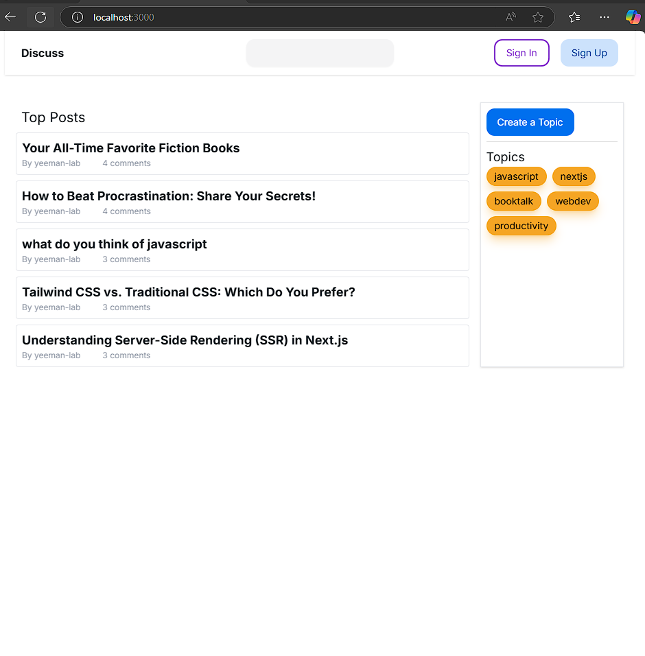
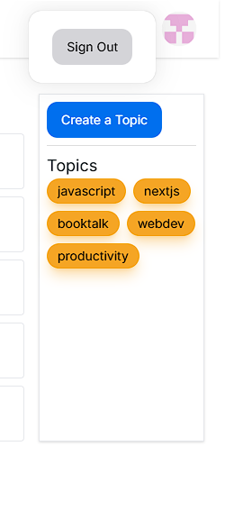
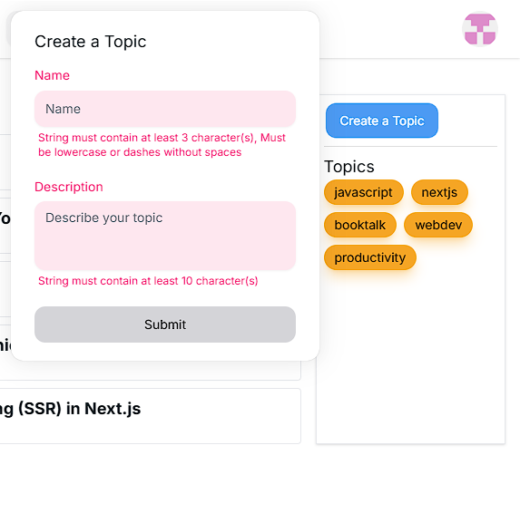
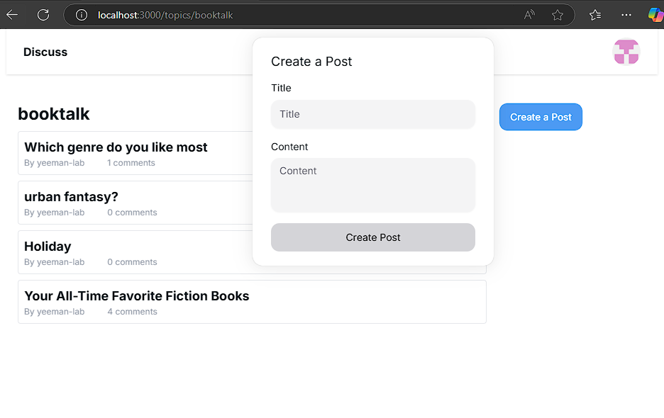
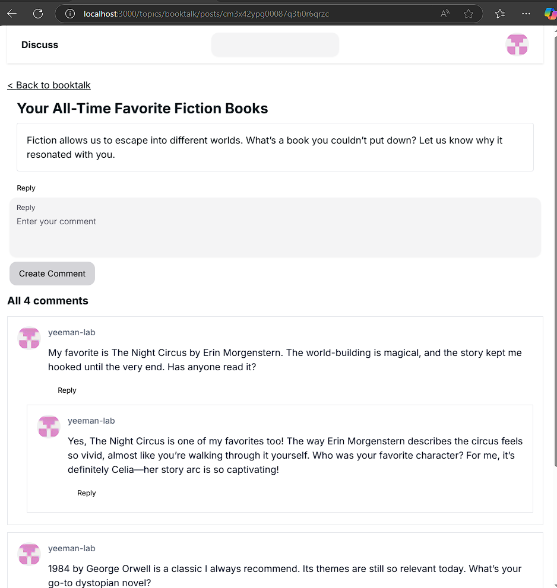

# Next.js - Discuss Project

This is a discussion platform built using Next.js, Prisma, and Tailwind CSS. It allows users to create posts, comment on them, as well as create and browse topics.

## Tech Stack

- **Frontend**: Next.js, Tailwind CSS
- **Database**: Prisma ORM with SQLite (or other database providers as configured)
- **UI Components**: NextUI for styled components
- **State Management**: React hooks for local state

## Features

- **Post Management**: Users can create posts under specific topics.
- **Commenting System**: Nested comments with parent-child relationships.
- **Search**: Search for posts using keywords.
- **Topics**: Organize posts by topics.
- **Top Posts**: Display the most commented posts.

## Getting Started

### Prerequisites

Ensure you have the following installed:

- [Node.js](https://nodejs.org/) (v18 or higher)
- [npm](https://www.npmjs.com/) or [yarn](https://yarnpkg.com/)
- [Prisma CLI](https://www.prisma.io/docs/orm/tools/prisma-cli)

---

### Installation

1. Clone the repository:

   ```bash
   git clone https://github.com/yeeman-lab/nextjs-discuss.git
   cd nextjs-discuss
   ```

2. Install dependencies:

   ```bash
   npm install
   ```

3. Configure environment variables:

   Create a **.env** file in the root directory and configure your database connection:

   ```bash
   DATABASE_URL="file:./dev.db"
   ```

   Create a **.env.local** file in the root directory and configure your O-auth variables. Below example is for Github service:

   ```bash
   GITHUB_CLIENT_ID="your client ID"
   GITHUB_CLIENT_SECRET="your client secret"
   AUTH_SECRET="your select secret"
   ```

4. Run database migrations:

   ```bash
   npx prisma migrate dev
   ```

## Development

Start the development server:

```bash
npm run dev
```

Navigate to http://localhost:3000 in your browser.

## Project Structure

```bash
src/
├── actions/               # Server actions for forms and authentication
├── app/                   # Routes and layouts files
│   ├── api/               # API routes
│   ├── search/            # Search result routes
│   ├── topics/            # Topic-specific routes
│   │   ├── [slug]/        # Dynamic topic routes
│   │   ├── posts/[postId] # Dynamic post routes
├── components/            # Reusable components
│   ├── comments/          # Comment-related components
│   ├── common/            # Common UI components
│   ├── posts/             # Post-related components
│   ├── topics/            # Topic-related components
├── db/                    # Database queries functions
├── public/                # Static assets (images, icons, etc.)
├── auth.ts                # Functions for user authentication
```

## Key Files

- **`/src/components`**: Contains reusable UI components like forms, buttons, and comment displays.
- **`/src/pages`**: Page components for routing and rendering UI.
- **`/src/db`**: Manages database queries using Prisma.
- **`/prisma/schema.prisma`**: Prisma schema definition for database models.
- **`/src/actions`**: Houses server-side actions for data handling.
- **`/src/api/`**: Contains API route handlers.

## Demonstrations

### 1. Homepage Before Signup

This image showcases the homepage when the user is not authenticated. The page includes:

- A list of **Top Posts** displayed in the main content area.
- A **sidebar** for topic management, showing options to create a new topic and a list of existing topics.
- The **header** displays **Sign In / Sign Up buttons** for user authentication.



### 2. Header After Sign In

This image highlights the header component after a user has successfully signed in:

- The **Sign In / Sign Up buttons** are replaced with a user icon.
- A **Popover menu** is available, providing option of signing out.



### 3. Create Topic Form with Validation

Here, the **Create Topic Form** is displayed inside a popover, allowing users to add a new topic:

- The form uses **zod** for schema validation and **useFormState** for managing form state.
- The validation feedback appears when the user submits invalid or incomplete input, guiding them to correct it.



### 4. Topic Show Page

This image demonstrates the **Topic Show Page**, which lists all posts under a specific topic:

- The **topic slug** is displayed prominently at the top.
- Each post in the topic is shown with its **title**, **author**, and count of **comments**.
- The list of posts displayed here is a **reusable component** that is also used to render the **Top Posts** list on the homepage.



### 5. Post Show Page

This image illustrates the **Post Show Page**, where the details of a specific post are displayed:

- The post’s **title** and full **content** are shown.
- Below the post, a list of **comments** is available, including nested comments with parent-child relationships.
- Users can engage with the content by adding their own comments or replying to others.



## License

This project is licensed under the MIT License.
